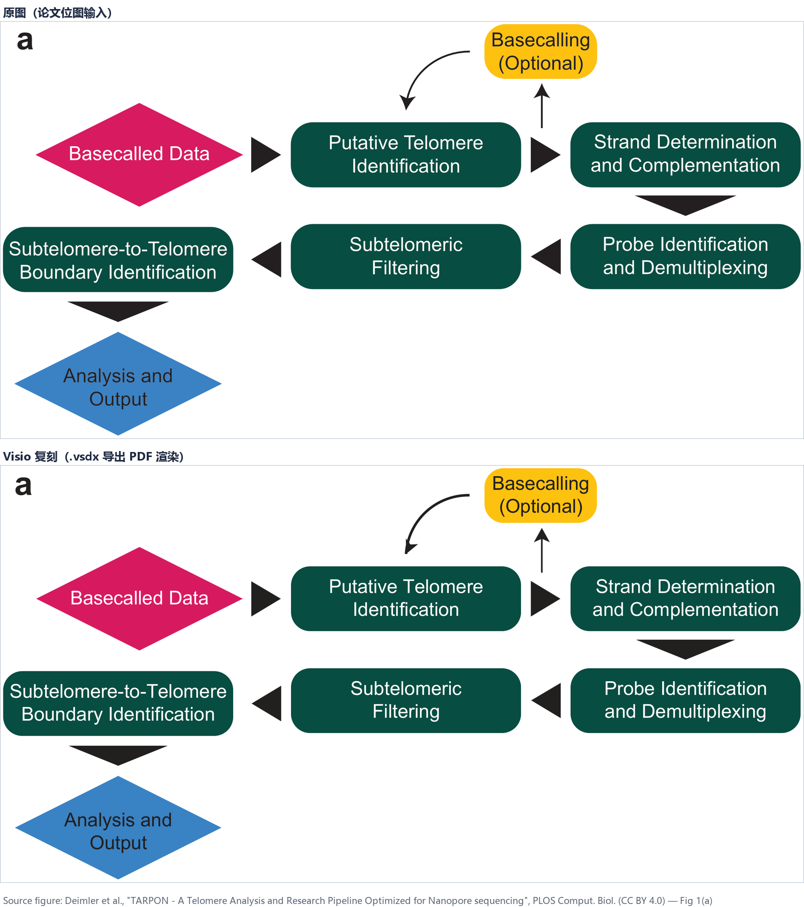
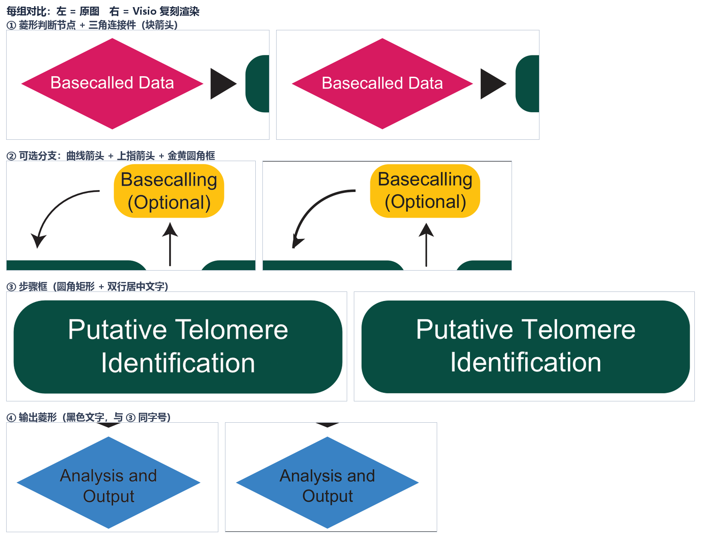

# vsdx-replicate

**位图流程图 → 可编辑 Visio (.vsdx) 的 1:1 复刻技能**，面向 ZCode / Claude Code 类 Agent 环境。

给定一张位图截图或矢量导出图，按以下管线产出外观 1:1、全部形状独立可选中可编辑的 `.vsdx`：

```
像素级提取(调色板→色块bbox→线网→放大目检) → 位图素材裁剪
→ Visio COM 渲染(几何+纯文本) → XML 后处理(富文本/字体/粗斜体/下标)
→ PDF 栅格化分区对比 → 迭代修正 → 交付
```

核心价值不在"生成 vsdx"，而在沉淀了这一流程里所有的坑：`pywin32` 驱动 Visio COM 的坐标/单位约定、多 run 富文本必须走 OPC XML 后处理（COM 的 `CharProps` 浮点值会被强转整型、颜色 >32767 溢出 I2）、虚线/跳线(hop)/箭头起止的线网检测方法、禁用 `page.Export` 的对比链路（Visio 会拉伸到缓存画布）等。

## 效果演示

论文配图（位图输入）与 Visio 复刻渲染（.vsdx 导出 PDF）整页对比：



细节特写（左 = 原图，右 = 复刻）—— 判断菱形、三角连接件、曲线箭头与可选分支、圆角步骤框、输出菱形：



示例复刻产物共 **19 个形状**全部独立可选中/可编辑；分区像素对比整体 `px>60` 差异 3.4%（主要为字体渲染差异），文字行位/行距误差 ≤3px。可下载 [examples/tarpon-flowchart/replica.vsdx](examples/tarpon-flowchart/replica.vsdx) 用 Visio 打开验证。

> 示例图片：Deimler et al., "TARPON", *PLOS Computational Biology* (2026), Fig 1(a)，[CC BY 4.0](https://creativecommons.org/licenses/by/4.0/)。

## 目录结构

```
vsdx-replicate/
├── SKILL.md                    # 完整方法论与全部踩坑记录（Agent 技能入口）
├── scripts/                    # 参考实现（对真实论文流程图跑通）
│   ├── extract.py              # Stage 1：调色板 + 色块 bbox 提取（近邻色并查集合并）
│   ├── trace2.py               # 线网追踪：实线/虚线/箭头/跳线(hop)
│   ├── render.py               # Stage 3：COM 渲染，几何 + 纯文本 + runs dump
│   ├── patch_text.py           # Stage 4：vsdx OPC XML 富文本（[vsdx] [runs] 参数）
│   └── export_compare.py       # Stage 5：PDF 导出 → 栅格化 → 差异对比（--src/--vsdx）
├── examples/
│   └── tarpon-flowchart/       # 完整示例：源图 + 复刻 vsdx + 场景脚本 + 复跑说明
└── docs/                       # 效果对比图
```

## 快速开始（以示例为例）

```bash
pip install pywin32 opencv-python pillow pymupdf

cd examples/tarpon-flowchart
python render_example.py                                                  # 几何 + 纯文本
python ../../scripts/patch_text.py out/replica.vsdx out/text_runs.json    # 富文本
python ../../scripts/export_compare.py --src source.png --vsdx out/replica.vsdx
```

复刻新图：把 `scripts/` 拷到新目录，替换 `render.py` 里的 `SRC` 路径、页面宽高 `W/H` 与场景数据（形状/线网/文本坐标）即可。

## 环境要求

- Windows + 本机安装 Microsoft Visio（COM 自动化是渲染核心）
- Python 3.x，依赖见 `requirements.txt`

无 Visio 的机器可改走手写 OPC XML 路线（参考 Microsoft [MS-VSDX] 规范），本技能不适用批量转换场景（请用 drawio CLI `-f vsdx`）。

## 验收标准（详见 SKILL.md）

- Visio 打开无修复提示，全部形状独立可选中/可编辑
- 分区对比：位图区 <3%，线网/容器错位 ≤2px
- 文字逐字一致，粗斜体/下标/竖排/灰字齐全，无换行溢出

## License

MIT（代码与文档）；示例论文配图按其原许可 CC BY 4.0 使用并署名。